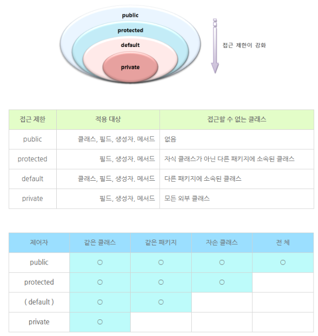

# 접근제어자
public 은 접근할 수 없는 클래스가 없이 접근을 제한하지 않는다.

protected은 같은 패키지만 허용하나, 상속을 받은 경우 다른 패키지에서도 사용 가능하다.

default는 같은 패키지에서 사용 가능하다.

private는 해당 클래스에서만 사용 가능하다.

 

 

참고링크
[[JAVA] 접근제어자 public, protected, default, private](https://velog.io/@damhee6624/JAVA-%EC%A0%91%EA%B7%BC%EC%A0%9C%EC%96%B4%EC%9E%90-public-protected-default-private)

